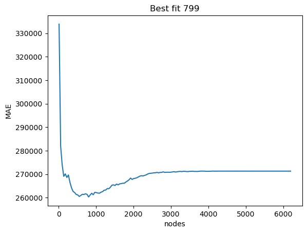
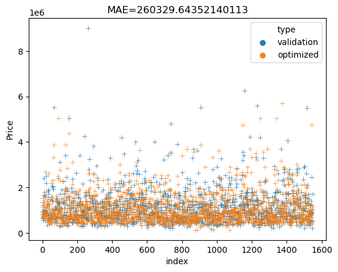
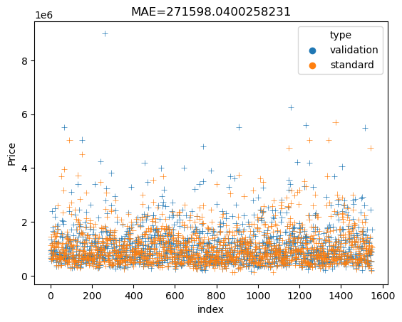

# Projeto: Impacto do número máximo de nós em uma árvore de decisão na métrica MAE
Este projeto tem como objetivo demonstrar a diferença no valor da métrica MAE (Mean Absolute Error) em um algoritmo de árvore de decisão, ao se alterar o parâmetro de número máximo de nós permitidos na árvore.

### Pré-requisitos
Antes de executar o projeto, é necessário ter os seguintes pré-requisitos instalados:

Python (versão 3 ou superior)
Bibliotecas: scikit-learn, pandas, seaborn, numpy
### Como executar o projeto
Clone o repositório para sua máquina local
Abra o arquivo "main.py", esse pode ser executado como notebook, caso desejar, cada célula está demarcada por "##" em seu início e fim.
Execute cada célula do arquivo, observando os resultados e gráficos gerados.
### Descrição do dataset
Para este projeto, foi utilizado o conjunto de dados "Melbourne Housing" que contém informações sobre casas em Melbourne, como número de quartos, tamanho do terreno e preço de venda. O objetivo é prever o valor de uma casa a partir das informações contidas no dataset.

### Descrição do algoritmo de árvore de decisão
O algoritmo de árvore de decisão é uma técnica de aprendizado de máquina supervisionado que pode ser utilizado tanto para problemas de classificação quanto de regressão. Neste projeto, utilizamos uma árvore de decisão para resolver um problema de regressão.

A árvore de decisão é construída a partir da divisão dos dados em grupos homogêneos, baseados nos valores de suas variáveis explicativas. A construção é feita recursivamente, com cada divisão buscando maximizar a redução de impureza dos dados (por exemplo, minimizando o erro quadrático médio, no caso de uma regressão).

### Descrição da métrica MAE
A métrica MAE (Mean Absolute Error) é uma medida de erro muito utilizada em problemas de regressão. Ela é calculada pela média da diferença absoluta entre os valores observados e previstos para cada exemplo do conjunto de dados. Quanto menor o valor da MAE, melhor é o desempenho do modelo.

### Resultados esperados
Espera-se que, ao alterar o número máximo de nós permitidos na árvore de decisão, o valor da métrica MAE varie. Em geral, espera-se que o valor da MAE diminua à medida que aumentamos o número de nós permitidos, pois a árvore de decisão fica mais complexa e consegue modelar melhor os dados de treinamento. No entanto, em algum ponto, o modelo irá começar a sofrer de overfitting, ou seja, ele se ajusta demais aos dados de treinamento e começa a performar mal em novos dados.

No gráfico gerado acima podemos ver que, o algoritmo desempenha melhor quando colocamos um limite de 779 nós.

(Note que foram testados 150 possíveis valores, de 10 até o número total de ocorrências no dataset, entre esses, 779 nós, como limite, performou melhor)

### Conclusão
Este projeto demonstrou a importância do parâmetro de número máximo de nós em uma árvore de decisão e seu impacto na métrica de erro MAE. Ao analisar os resultados, é possível encontrar um equilíbrio entre a complexidade do modelo e sua capacidade de generalização para novos dados.

Abaixo é possível ver o desempenho da árvore limitada a 779 nós e a árvore construida sem o parâmetro de número máximo de nós especificados ("optimized" e "standard", respectivamente)

 

Perceba que "validation" se refere à fração do dataset voltada para avaliação do modelo.
